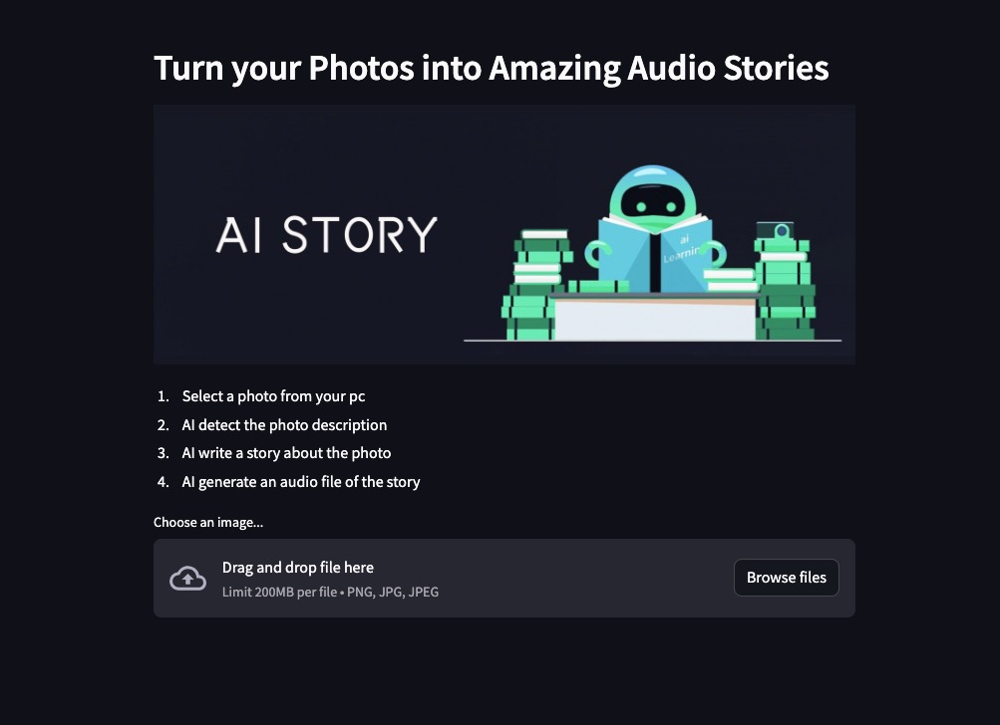

# ai-streamlit-example

使用 Python、Streamlit 和 Hugging Face 模型

## <a id="quick-start" href="#quick-start">🚀 Quick Start</a>

1. 註冊Hugging Face 並取得[Access Tokens](https://huggingface.co/settings/tokens)
2. 安裝Docker平臺軟體


### 🐳 Docker Start

The easiest way to run ai-streamlit-app locally is by using docker.

```
docker build -t ai-streamlit-app .
docker run -d --name ai-streamlit-app -p 8501:8501 ai-streamlit-app
```

## You will see a result like this

